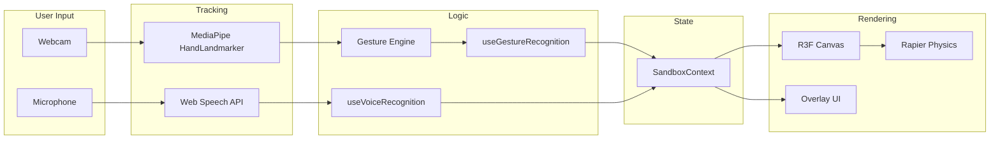

# 3D Gesture Sandbox - Fresh Build

## Tech Stack

- **React 19** + TypeScript 5 + Vite 6
- **@react-three/fiber v9** + **@react-three/drei** (latest) - React renderer for Three.js
- **@react-three/rapier v2** - WASM physics engine (gravity, rigid bodies, colliders, stacking, throwing)
- **@mediapipe/tasks-vision** (0.10.x) - Hand landmark detection via webcam
- **Web Speech API** (browser-native) - Voice command recognition
- **three** (latest) - 3D engine

## Project Structure

```
Tekton/
  package.json
  tsconfig.json
  tsconfig.node.json
  vite.config.ts
  index.html
  .gitignore
  src/
    main.tsx
    App.tsx
    styles.css
    types/
      index.ts                    # All type definitions
    constants/
      shapes.ts                   # Predefined shapes, colors, parsers
    context/
      SandboxContext.tsx           # Global state via useReducer + Context
    engine/
      gestures.ts                 # Gesture detection from hand landmarks
      physics.ts                  # Velocity tracking for throw mechanics
    hooks/
      useHandTracking.ts          # MediaPipe HandLandmarker integration
      useGestureRecognition.ts    # Maps hand gestures to 3D scene actions
      useVoiceRecognition.ts      # Web Speech API for voice commands
    components/
      Scene/
        Scene.tsx                 # Canvas + Physics wrapper
        Ground.tsx                # Ground plane (static RigidBody)
        Lighting.tsx              # Directional + ambient + hemisphere lights
        PhysicsObject.tsx         # Single object: RigidBody + collider + mesh
        SceneObjects.tsx          # Maps state.objects -> PhysicsObject
        Pointer3D.tsx             # 3D pointer sphere in the scene
      Camera/
        CameraController.tsx      # Gesture-driven orbit camera
      UI/
        Overlay.tsx               # Root overlay container
        HandVisualization.tsx     # Webcam + hand skeleton canvas
        StatusPanel.tsx           # Top-left: gesture, object count
        VoiceIndicator.tsx        # Bottom-left: mic status + last command
        Instructions.tsx          # Top-right: controls help
```

## Data Flow




## Detailed Implementation

### 1. Project scaffolding

Create `package.json` with all dependencies:

- `react@^19.0.0`, `react-dom@^19.0.0`
- `three@^0.172.0`, `@react-three/fiber@^9.0.0`, `@react-three/drei@^9.0.0`
- `@react-three/rapier@^2.2.0`
- `@mediapipe/tasks-vision@^0.10.32`
- Dev: `typescript@^5.7.0`, `@types/three`, `@types/react`, `@types/react-dom`, `vite@^6.0.0`, `@vitejs/plugin-react@^4.0.0`

Create `tsconfig.json` (strict, path alias `@` -> `./src`, jsx: react-jsx), `vite.config.ts` (react plugin, `@` alias), `index.html`, `.gitignore`.

### 2. Types and constants

`**src/types/index.ts**`: Define `ShapeType` (cube, sphere, cylinder, cone, torus, pyramid), `ColorName` (8 colors), `Vector3Tuple`, `SceneObject`, `HandData`, `GestureType`, `GestureState`, `PointerState`, `VoiceCommand`, `SandboxState`, `SandboxAction`, hand landmark constants, scene config.

`**src/constants/shapes.ts**`: Shape configs with default scales, color hex map, parsers for voice input (`parseShapeType`, `parseColorName`), random generators.

### 3. State management - `src/context/SandboxContext.tsx`

- `useReducer` with actions: ADD_OBJECT, REMOVE_OBJECT, UPDATE_OBJECT, SELECT_OBJECT, CLEAR_ALL, SET_POINTER, SET_GESTURE, SET_VOICE, SET_HAND_TRACKING, SET_LOADING, SET_PERMISSIONS
- Helper functions exposed via context: `addObject`, `removeObject`, `updateObjectPosition`, `selectObject`, etc.
- Initial state: 3 starter objects (a red cube, blue sphere, green cylinder) placed on the ground

### 4. Hand tracking - `src/hooks/useHandTracking.ts`

- Use `@mediapipe/tasks-vision` `HandLandmarker` (new API, not the deprecated `@mediapipe/hands`)
- Initialize with `FilesetResolver.forVisionTasks()` and load the hand landmarker model from CDN
- Create a `<video>` element, request `getUserMedia`, process frames in a `requestAnimationFrame` loop
- Return: `{ videoRef, canvasRef, isTracking, isLoading, error, startTracking, stopTracking }`
- Draw detected landmarks on the overlay canvas

### 5. Gesture engine - `src/engine/gestures.ts`

Pure functions (no React dependencies):

- `getPinchDistance(landmarks)` - distance between thumb tip and index tip
- `isPinching(landmarks, threshold)` - boolean pinch detection
- `getPointerPosition(landmarks)` - index finger tip position in normalized coords
- `detectGesture(landmarks)` - returns `'pinch'`, `'point'`, or `'none'`
- `screenToWorld(screenPos, camera, groundPlane)` - project screen point to 3D world via raycasting

### 6. Gesture recognition hook - `src/hooks/useGestureRecognition.ts`

The core interaction bridge:

- Receives hand landmarks each frame, calls gesture engine functions
- Raycasts pointer position into the 3D scene
- **Pinch on object**: Enter grab mode, set object's RigidBody to `kinematicPosition`, move it with the hand
- **Pinch on empty space**: Enter camera orbit mode, rotate camera around scene center based on hand movement
- **Release pinch**: Exit grab, set RigidBody back to `dynamic`, apply velocity vector (for throwing)
- **Point gesture**: Show pointer at world position, highlight hovered objects
- Stores a position history buffer (last 5 frames) to compute release velocity for throwing
- Exposes a `rigidBodyRefs` map so it can toggle kinematic/dynamic on grab/release

### 7. Voice recognition - `src/hooks/useVoiceRecognition.ts`

- Web Speech API (`SpeechRecognition` / `webkitSpeechRecognition`)
- Continuous listening mode
- Parse commands: "create [color] [shape]" -> spawns object at current pointer position; "delete" -> removes selected object; "clear" / "clear all" -> removes all
- Update context with parsed commands and status

### 8. Physics-enabled scene objects

`**src/components/Scene/PhysicsObject.tsx**`:

- Wraps a Three.js mesh inside a Rapier `<RigidBody>`
- Accepts a `rigidBodyRef` callback so the gesture hook can switch between dynamic/kinematic
- Auto-selects collider type based on shape: `cuboid` for cube/pyramid, `ball` for sphere, `hull` for cylinder/cone/torus
- Cast shadows, receive shadows
- Visual selection outline (wireframe overlay when selected)
- Subtle hover highlight (emissive glow)

`**src/components/Scene/SceneObjects.tsx**`:

- Maps `state.objects` -> `<PhysicsObject>` components
- Passes pointer event handlers for hover/select

`**src/components/Scene/Ground.tsx**`:

- `<RigidBody type="fixed">` with a large cuboid collider
- Flat plane mesh with shadow receiving

### 9. Scene setup - `src/components/Scene/Scene.tsx`

- `<Canvas shadows>` with camera config (position [0, 8, 12], fov 60)
- `<Physics gravity={[0, -9.81, 0]}>` wrapping all physical content
- `<Lighting />` - directional (with shadow map), ambient, hemisphere
- `<Ground />`
- `<SceneObjects />`
- `<Pointer3D />` - visible pointer sphere at gesture position
- `<CameraController />` - reads camera state, applies orbit
- Background color `#1a1a2e`, fog for depth
- `<Environment preset="city" />` for reflections

### 10. Camera controller - `src/components/Camera/CameraController.tsx`

- When gesture is "camera orbit" (pinch on empty space), compute spherical coordinates from hand delta
- Smoothly interpolate camera position using `useFrame`
- Fall back to `<OrbitControls>` when no gesture detected (mouse/touch backup)

### 11. Pointer visualization - `src/components/Scene/Pointer3D.tsx`

- Small glowing sphere at the raycasted world position
- Color changes: white (idle), yellow (hovering object), cyan (grabbing)
- Pulsing animation
- Only visible when hand is detected and pointing/pinching

### 12. Overlay UI components

- `**Overlay.tsx**`: Container for all 2D UI overlaid on the canvas
- `**HandVisualization.tsx**`: Small webcam preview (bottom-right corner) with hand skeleton drawn on canvas
- `**StatusPanel.tsx**`: Top-left panel showing gesture type, object count, selected object name
- `**VoiceIndicator.tsx**`: Bottom-left mic icon with pulse animation when listening, shows last command
- `**Instructions.tsx**`: Top-right collapsible panel with control descriptions

### 13. App.tsx - Main orchestration

- `<SandboxProvider>` wrapping everything
- Permission request flow (camera + microphone)
- Initialize hand tracking and voice recognition after permissions granted
- Frame loop: process hand landmarks -> gesture recognition -> update state
- Render `<Scene>` and `<Overlay>`

### 14. Styles - `src/styles.css`

- Full-viewport dark layout
- Canvas fills entire screen
- Overlay positioned absolute on top
- Glassmorphism panels (backdrop-blur, semi-transparent backgrounds)
- Pulse animations for voice indicator
- Loading spinner and permission prompt styling

