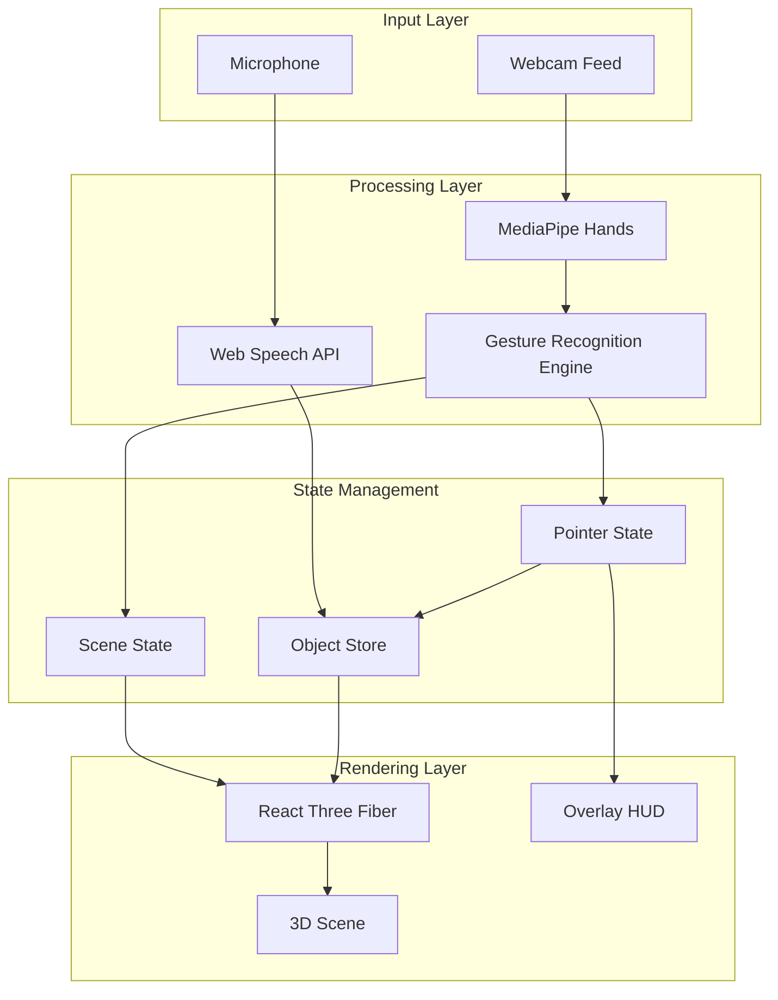
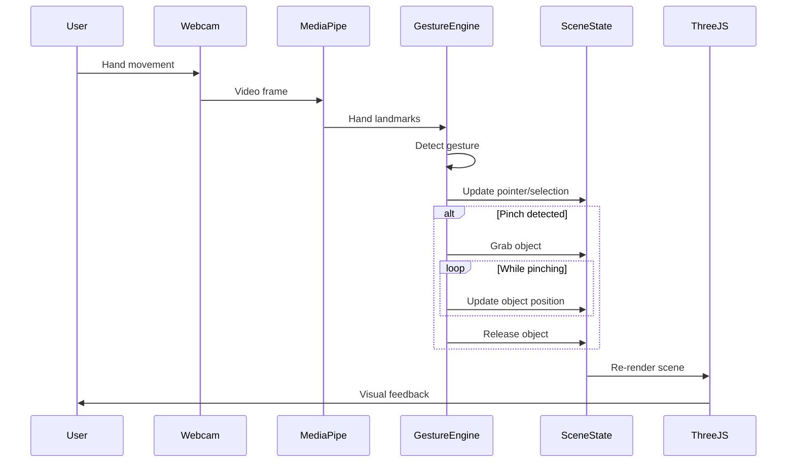

# 3D Gesture-Controlled Sandbox

## Architecture Overview




## Technology Stack

- **Build Tool**: Vite
- **Framework**: React 18 with TypeScript
- **3D Engine**: Three.js via `@react-three/fiber` and `@react-three/drei`
- **Hand Tracking**: MediaPipe Hands (via `@mediapipe/hands`)
- **Voice Recognition**: Web Speech API (browser native)
- **State Management**: React Context + useReducer

## Project Structure

```
src/
├── main.tsx                    # App entry point
├── App.tsx                     # Main component
├── styles.css                  # Global styles
├── types/
│   └── index.ts                # TypeScript interfaces
├── context/
│   └── SandboxContext.tsx      # Global state management
├── hooks/
│   ├── useHandTracking.ts      # MediaPipe hands integration
│   ├── useGestureRecognition.ts # Gesture detection logic
│   └── useVoiceRecognition.ts  # Web Speech API integration
├── components/
│   ├── Scene/
│   │   ├── Scene.tsx           # Main 3D scene
│   │   ├── Ground.tsx          # Plane/ground with shadows
│   │   ├── Lighting.tsx        # Light sources
│   │   └── SceneObject.tsx     # Individual 3D object component
│   ├── UI/
│   │   ├── Overlay.tsx         # HUD overlay
│   │   ├── Pointer.tsx         # Visual pointer indicator
│   │   ├── HandVisualization.tsx # Hand landmark display
│   │   └── VoiceIndicator.tsx  # Voice recognition status
│   └── Camera/
│       └── CameraController.tsx # Orbit/gesture camera control
├── engine/
│   ├── gestures.ts             # Gesture definitions and detection
│   ├── objectFactory.ts        # Create predefined shapes
│   └── physics.ts              # Basic stacking/collision logic
└── constants/
    └── shapes.ts               # Predefined shapes and colors
```

## Core Features Implementation

### 1. Hand Gesture System

**Supported Gestures:**


| Gesture                       | Action                      |
| ----------------------------- | --------------------------- |
| Point (index finger extended) | Show pointer, select object |
| Pinch (thumb + index close)   | Grab/release object         |
| Open palm                     | Pan camera                  |
| Fist                          | Reset view                  |
| Two-finger pinch              | Scale selected object       |
| Swipe                         | Rotate camera               |


**Implementation approach:**

- Use MediaPipe Hands to track 21 hand landmarks per hand
- Calculate finger states (extended/curled) using joint angles
- Detect pinch distance between thumb tip and index tip
- Map hand position to 3D world coordinates using raycasting

### 2. Voice Recognition Commands

**Supported Commands:**

- "Create [shape]" - Creates object at pointer position
- "Create [color] [shape]" - Creates colored object
- "Delete" - Removes selected object
- "Clear all" - Removes all objects

**Shapes:** cube, sphere, cylinder, cone, torus, pyramid

**Colors:** red, blue, green, yellow, orange, purple, white, black

### 3. 3D Scene Setup

```typescript
// Scene configuration
const sceneConfig = {
  ground: {
    size: [20, 20],
    color: '#a0a0a0',
    receiveShadow: true
  },
  lighting: {
    ambient: { intensity: 0.4 },
    directional: {
      position: [10, 15, 10],
      intensity: 1,
      castShadow: true,
      shadowMapSize: 2048
    }
  },
  camera: {
    position: [0, 8, 12],
    fov: 60
  }
};
```

### 4. Object State Structure

```typescript
interface SceneObject {
  id: string;
  type: 'cube' | 'sphere' | 'cylinder' | 'cone' | 'torus' | 'pyramid';
  position: [number, number, number];
  rotation: [number, number, number];
  scale: [number, number, number];
  color: string;
  isSelected: boolean;
}
```

### 5. Pointer Visualization

- Render a 3D cursor/sphere at the intersection point of hand ray with scene
- Change pointer color based on state (idle, hovering object, grabbing)
- Show visual feedback during gesture detection

## Key Dependencies

```json
{
  "dependencies": {
    "react": "^18.2.0",
    "react-dom": "^18.2.0",
    "@react-three/fiber": "^8.15.0",
    "@react-three/drei": "^9.88.0",
    "three": "^0.158.0",
    "@mediapipe/hands": "^0.4.1675469240",
    "@mediapipe/camera_utils": "^0.3.1675466862"
  },
  "devDependencies": {
    "typescript": "^5.3.0",
    "@types/react": "^18.2.0",
    "@types/three": "^0.158.0",
    "vite": "^5.0.0",
    "@vitejs/plugin-react": "^4.2.0"
  }
}
```

## Data Flow




## Implementation Notes

1. **MediaPipe Setup**: MediaPipe Hands WASM files need to be served from `/mediapipe/hands/` in the public folder. The library loads these files at runtime.
2. **Performance**: Run hand tracking at ~30fps to balance accuracy and performance. Use `requestAnimationFrame` for smooth updates.
3. **Coordinate Mapping**: Map 2D hand position (normalized 0-1) to 3D world coordinates using camera projection and raycasting against the ground plane.
4. **Stacking Logic**: When releasing an object, raycast downward to detect objects below and snap to their top surface using bounding box calculations.
5. **Shadow Setup**: Enable shadow maps on the renderer, set `castShadow` on objects and light, set `receiveShadow` on ground plane.

